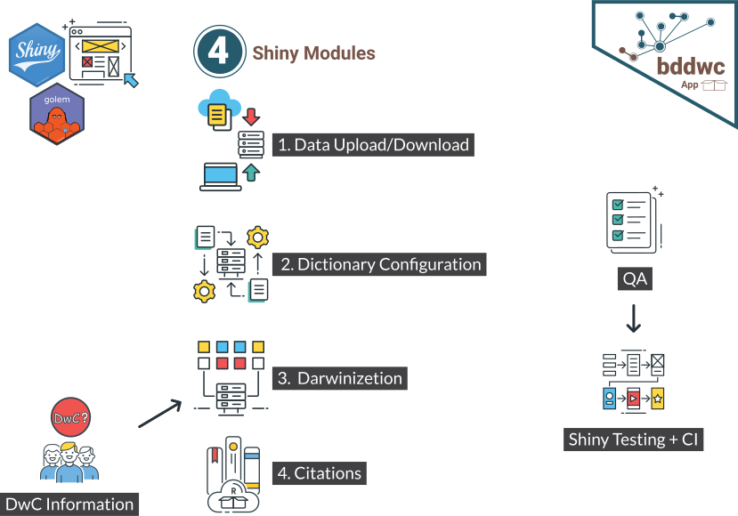
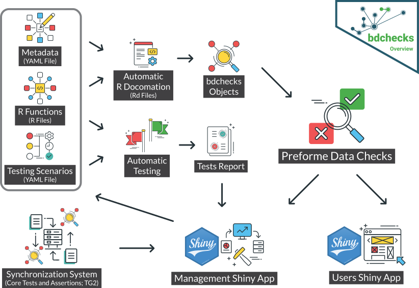
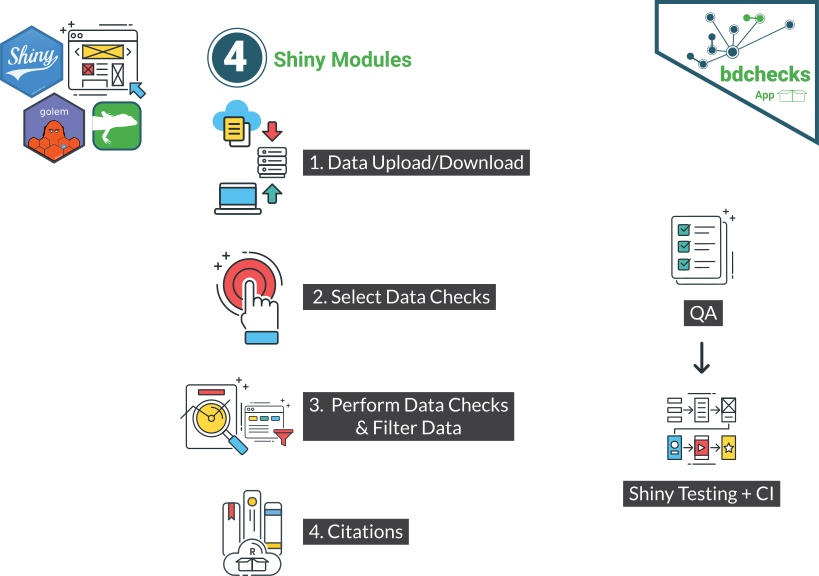
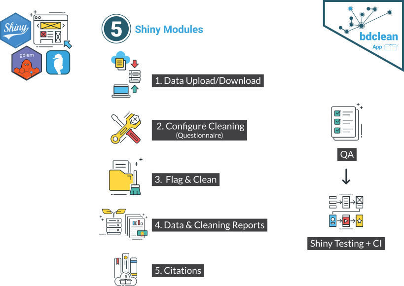

# Architecture  {#architecture}

## Overall `bdvers`architecture {-}

## Packages: {-}

## `bddwc`

#### Overview Design {#help-needed}

```{r, echo = FALSE, fig.cap="bddwc overview"}
knitr::include_graphics("images/arc/Arc_bddwc_overview.svg")
```


#### R functions dependency & information 
```{r pkgnet-R-functions, message=FALSE, warning=FALSE, echo=FALSE}
library(pkgnet)
pkgnet:::silence_logger()
funcReporter2 <- pkgnet::FunctionReporter$new()
funcReporter2$layout_type <- "layout_as_tree"
funcReporter2$set_package(
  pkg_name = "bdDwC",
)
funcReporter2$calculate_default_measures()
g <- visNetwork::visHierarchicalLayout(
  graph = funcReporter2$graph_viz
  , direction = "BU"
  , sortMethod = "hubsize"
  , edgeMinimization = FALSE
)
g <- visNetwork::visInteraction(graph = g
                                , dragNodes = TRUE
                                , dragView = TRUE
                                , zoomView = FALSE)
g
```

```{r create_tbl, include=FALSE}
library(tools)
library(tidyverse)
tbl <-
  tibble::tibble(
  FunctionName = funcReporter2$graph_viz$x$nodes$node,
  
  Title = unlist(lapply(funcReporter2$graph_viz$x$nodes$node, function(x) {
    rd_gh_path <- paste0("https://raw.githubusercontent.com/bd-R/bdDwC/master/man/",x,".Rd")
    rd_file <- parse_Rd(rd_gh_path)
    tags <- tools:::RdTags(rd_file)
    title_text <- rd_file[[which(tags == "\\title")]][1][[1]][1]
  })),
  
  Description = unlist(lapply(funcReporter2$graph_viz$x$nodes$node, function(x) {
    rd_gh_path <- paste0("https://raw.githubusercontent.com/bd-R/bdDwC/master/man/",x,".Rd")
    rd_file <- parse_Rd(rd_gh_path)
    tags <- tools:::RdTags(rd_file)
    des_text <- rd_file[[which(tags == "\\description")]][2][[1]][1]
  })),
  
  isExported = funcReporter2$graph_viz$x$nodes$isExported,
  
  GithubURL = c('<a href="https://github.com/bd-R/bdDwC/blob/master/R/dictionary.R#L86">Link</a>',
               '<a href="https://github.com/bd-R/bdDwC/blob/master/R/darwinizer.R#L23">Link</a>',
               '<a href="https://github.com/bd-R/bdDwC/blob/master/R/dictionary.R#L27">Link</a>',
               '<a href="https://github.com/bd-R/bdDwC/blob/master/R/dictionary.R#L130">Link</a>',
               '<a href="https://github.com/bd-R/bdDwC/blob/master/R/darwinizer.R#L203">Link</a>',
               '<a href="https://github.com/bd-R/bdDwC/blob/master/R/darwinizer.R#L152">Link</a>',
               '<a href="https://github.com/bd-R/bdDwC/blob/master/R/test.R#L96">Link</a>',
               '<a href="https://github.com/bd-R/bdDwC/blob/master/R/test.R#L116">Link</a>',
               '<a href="https://github.com/bd-R/bdDwC/blob/master/R/test.R#L39">Link</a>',
               '<a href="https://github.com/bd-R/bdDwC/blob/master/R/test.R#L68">Link</a>',
               '<a href="https://github.com/bd-R/bdDwC/blob/master/R/test.R#L11">Link</a>'
  ))
```
```{r use_dt, echo=FALSE}
tbl %>% DT::datatable(escape = FALSE, options = list("pageLength" = 11))
```

## `bddwc.app` {#help-needed}

```{r, echo = FALSE, fig.cap="Shiny App overview"}

```

## `bdchecks`
#### Overview Design 

```{r, echo = FALSE, fig.cap="bdchecks overview"}

```

## `bdchecks.app`

```{r, echo = FALSE, fig.cap="bdchecks Shiny App"}

```
## `bdclean`

```{r, echo = FALSE, fig.cap="bdclean Shiny App"}

```

## `bdutilities`

## `bdutilities.app`


## Packages in the making {-}

### `bdvis`

### `bdtools`