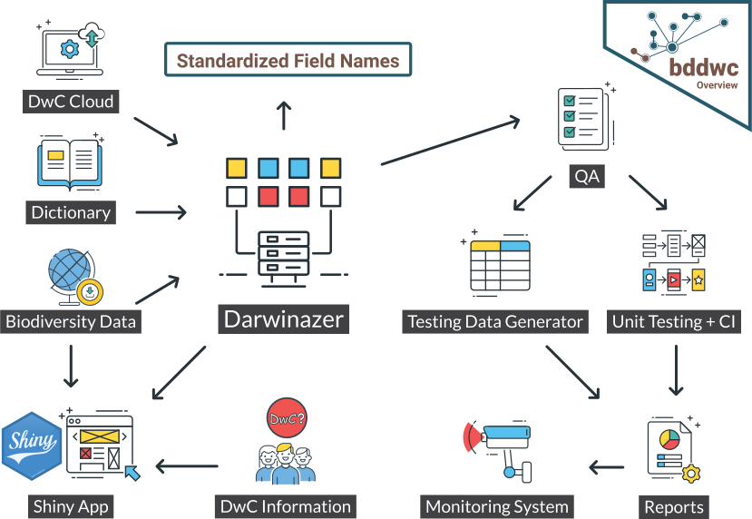

# Architecture  {#architecture}

## Overall `bdvers`architecture {-}

## Packages: {-}

## `bddwc`

#### Overview Design 

(\#fig:unnamed-chunk-1)bddwc overview

#### R functions dependency & information 
<!--html_preserve-->

<!--/html_preserve-->

<!--html_preserve-->

<!--/html_preserve-->

## `bddwc.app`

(\#fig:unnamed-chunk-2)Shiny App overview

## `bdchecks`
#### Overview Design 

(\#fig:unnamed-chunk-3)bdchecks overview

## `bdchecks.app`

(\#fig:unnamed-chunk-4)bdchecks Shiny App

## `bdclean`

(\#fig:unnamed-chunk-5)bdclean Shiny App

## `bdutilities`

## `bdutilities.app`

## Packages in the making {-}

### `bdvis`

### `bdtools`
