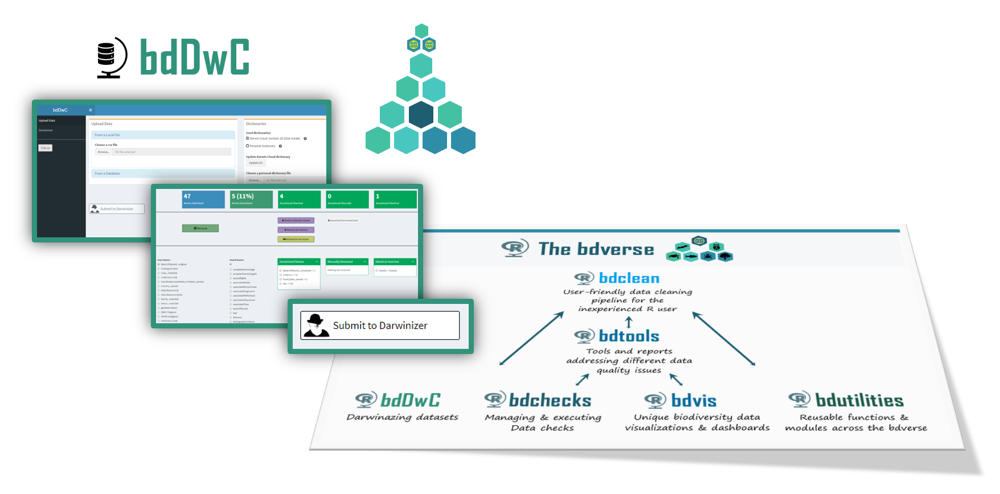

# bddwc {#bddwc .bddwc}

## bddwc & Darwin Core
`bdDwC` is a R package that supplies an interactive Shiny app and a set of functions for standardizing field names in compliance to the Darwin Core (DwC) format. `bdDwC` is a key element in the `bdverse`-- a collection of tools, that form a general framework for facilitating biodiversity science in R.


**<span style="color:red">--> To replace with new bddwc overview <--</span>**

### What is the Darwin Core standard? {-}

Darwin Core (DwC) is a global standard for publishing biodiversity data, whose goal is to facilitate the sharing of biodiversity information, by providing identifiers, labels, and definitions [@DwC-paper]. DwC was established as an evolving community-developed standard, by the Biodiversity Information Standards Working Group (www.tdwg.org). DwC is a library of definitions of common biodiversity data terms, each of which represents a field within the database. There are around 200 such fields (not including DwC extensions); a full set of the DwC terms with their descriptions is available in the Quick Reference Guide (http://rs.tdwg.org/dwc/terms). For more information see  [`Learn more` section](#learn).

### Why it's important to "Darwinize" a dataset {-}

Running the Darwinizer enables you to standardize many field names in your dataset -- and that allows the `bdverse` to handle data from various biodiversity portals seamlessly, and lets you enjoy all of `bdvers` features, regardless of publishers variation in field names.


## Shiny app


### Launching the app

```r
library(bdDwC) # Laod package library
runDwC() # Launch the app
```

### App overview

[comment]: <> (Need-To-Be-Updated!)


**<span style="color:red">--> To replace with the new app <--</span>**
 In the first screen, you'll need to load your biodiversity data; choose dictionary and run the Darwinizer. There are two options, form a file on your computer, of fetch from a web based data provider.

### Data upload {#dataupload}

#### From a local file

A CSV file or a Darwin Core Archive (DwC-A) zip file can be uploaded.


[comment]: <> (Need-To-Be-Updated!)


 **<span style="color:red">--> To replace with the new app <--</span>**

### From an online database {#datadownload}

Also, data can be retrieved directly from various online biodiversity databases. You need only to:

* Select the database
* Specify the desired scientific name.
* Specify the number of records (upper limit of 50,000).
* Check the box if records must have coordinates.
* Wait for data to be downloaded.

[comment]: <> (Need-To-Be-Updated!)


**<span style="color:red">--> To replace with the new app <--</span>**

## Dictionaries

A dictionary is a key component when Darwinizing a dataset. It's basically a lookup table that lists a possible variation of field name and it corresponding DwC name.


### The Darwin Cloud dictionary

The Darwin Cloud dictionary [@DarwinCloud], is a lookup table that accumulates different variations in DwC field names from different publishers. This valuable and critical dictionary was created and is maintained by the Kurator project (http://kurator.acis.ufl.edu/kurator-web/), which provides workflow tools for data quality improvement of biodiversity data, via a user-friendly web interface. The development of bdDwC was inspired by <a href= https://github.com/kurator-org/kurator-validation/wiki/CSV-File-Darwinizer target="_blank">Kurator's own Darwinizer</a>.

#### Updating the Darwin Cloud dictionary{-}

It's recommended to update the Darwin Cloud dictionary file. This can be done easily by clicking the **Update DC** button.

[comment]: <> (Need-To-Be-Updated!)


**<span style="color:red">--> To replace with the new app <--</span>**

### Custom dictionary

It's also possible to add your own dictionary by creating a CSV file with two columns, one for the Field Names and one for the Standard Names. After uploading the custom disctionary, we need to specify which field denotes the 'User fierld names' and which is the 'Standard (DwC) field names'. 

[comment]: <> (Need-To-Be-Updated!)


**<span style="color:red">--> To replace with the new app <--</span>**

## Darwinizing your dataset

Once a dataset is uploaded, the 'Submit to Darwinizer' button is activated, Clicking it will begin the interactive 'Darwinize the dataset' process.

[comment]: <> (Need-To-Be-Updated!)


**<span style="color:red">--> To replace with the new app <--</span>**

### Darwinizer results

Results page overwiew

[comment]: <> (Need-To-Be-Updated!)


**<span style="color:red">--> To replace with the new app <--</span>**

Manually renaming field names can be done very easily, just choose the two corresponding fields and click the Rename button. 

[comment]: <> (Need-To-Be-Updated!)


**<span style="color:red">--> To replace with the new app <--</span>**

Hovering over a DwC standard name will display its description.


### Download your Darwinized data

[comment]: <> (Need-To-Be-Updated!)

### Closing the app
Just close the app browser tab, and the R session will be terminated. To reopen it run in the R Console `runDwC()`.

## Command line operations

**<span style="color:red">--> To synchronize functions with the new version!!!! <--</span>**

## Load package
Load the `bdDwC` package
```r
    library(bdDwC)
```

## Darwinizing a dataset

`bdDwC` contains Indian Reptile dataset `bdDwC:::dataReptiles`.


The function to Darwinize a dataset is`darwinizeNames` (replace `bdDwC:::dataReptiles` with wanted dataset):

```r
result <- darwinizeNames(dataUser = bdDwC:::dataReptiles,
                            dataDWC   = bdDwC:::dataDarwinCloud$data)
```
You can replace `bdDwC:::dataReptiles` with your dataset

Rename your dataset field names to Darwinized names using `renameUserData`:

```r
renameUserData(bdDwC:::dataReptiles, result)
```
## Updating [the Darwin Cloud dictionary]

To get newest version of Darwin Cloud Data run:

```r
downloadCloudData()
```
which will download data from the remote repository and extract field and standard names.

## A case study

### Case study title {-}
***

**<span style="color:red">[ TBA ]</span>**
